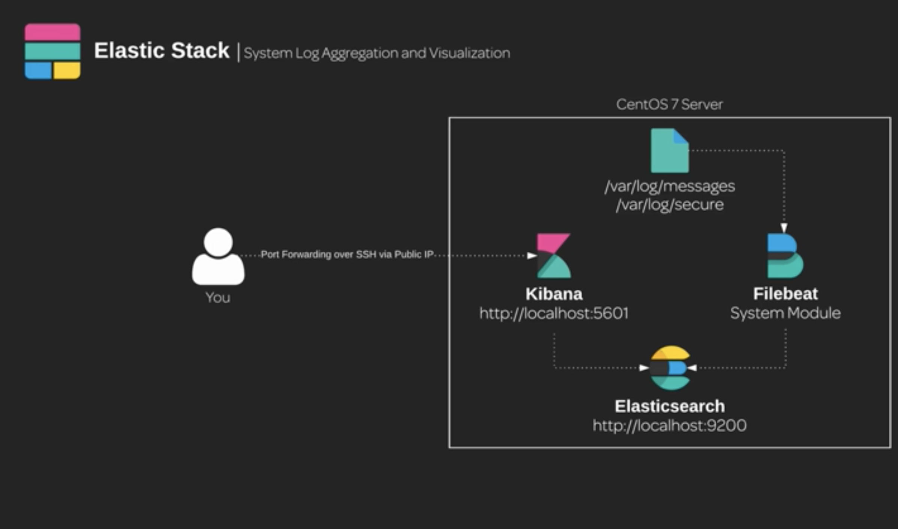

# System Log Aggregation and Visualization with Elastic Stack

For security professionals and system administrators, knowing what is going on with your systems is an important aspect of maintaining their integrity and uptime. With Elastic Stack, we can quickly create a log aggregation pipeline for the system authentication and syslog log files on a Linux/Unix system to collect usage data about our systems and store them in Elasticsearch to be centrally searched and visualized with Kibana.

Internal security teams can access system and security logs in a centralized manner (/var/log/message and /var/log/secure). FOr this example which is for a public facing CentOS 7 production system for visualizing security information and event management (SIEM). To faciliate this, the following have been installed:

* Elasticsearch
* Filebeat
* Metricbeat
* Kibana

## Dashbaord

You can access Kibana with the guest IP address on port 5601 and expect to have system logs available for both searching and visualizing via dashboards. Once all the services are installed, working together, and configured to startup after a system reboot, you should access Kibana over an SSH tunnel and make sure the system dashboards are ready for the security team to analyze.